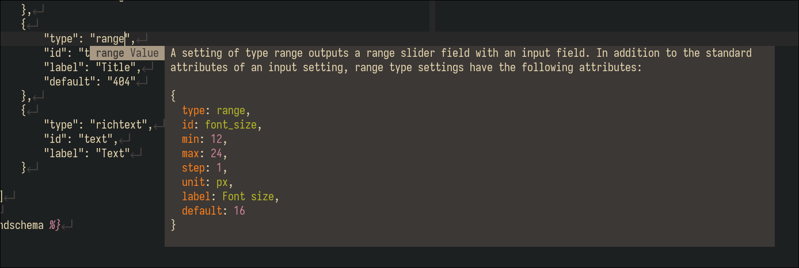

# Shopify section input types for cmp

**If you're looking for a blink version of this plugin you can find it [here](https://github.com/JulianH99/blink-shopify-input-types)**

I created this simple, almost too hacky cmp source to be able to work with the
schema definition of a shopify section without having to visit their api site
every time. This cmp source simply completes the input type in any part of the
liquid file (for now) and shows the first descrpition along with the example on
how to use the input type of choice

## How types are fetched
I said this was too hacky, because it is. Since shopify cli does not provide
information on this kind of inputs, I wrote a python script to fetch them from
the site itself. Now, this script is not ran by the plugin, but is included in
the repo if you want to take a look. This script generates a json file that is
then read by the plugin to provide cmp items.


## Installing
No big deal, add it to your dependencies for cmp on lazy.nvim:
```lua

return {
  "hrsh7th/nvim-cmp",
  event = "InsertEnter",
  dependencies = {
    -- .. other depencencies
    { "JulianH99/cmp-shopify-input-types" },
  },
  config = function()
    -- config stuff ...
  end
}
```
If you use another package manager and can't find a way to configure it, feel
free to open an issue

## Configuring
To configure it as a source, you only need to included in your sources table for
cmp:
```lua

require'cmp'.setup({
  -- rest of configuration
  -- configure sources
  sources = cmp.config.sources({
    { name = "nvim_lsp" },
    { name = "path" },
    { name = "buffer" },
    { name = "shopify-input-types" }, -- I add it before luasnip out of personal preference, you can add it where you want
    { name = "luasnip" },
  }),
})

```
By default, the source will only be available for `.liquid` files




